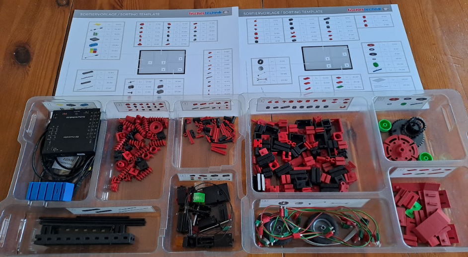
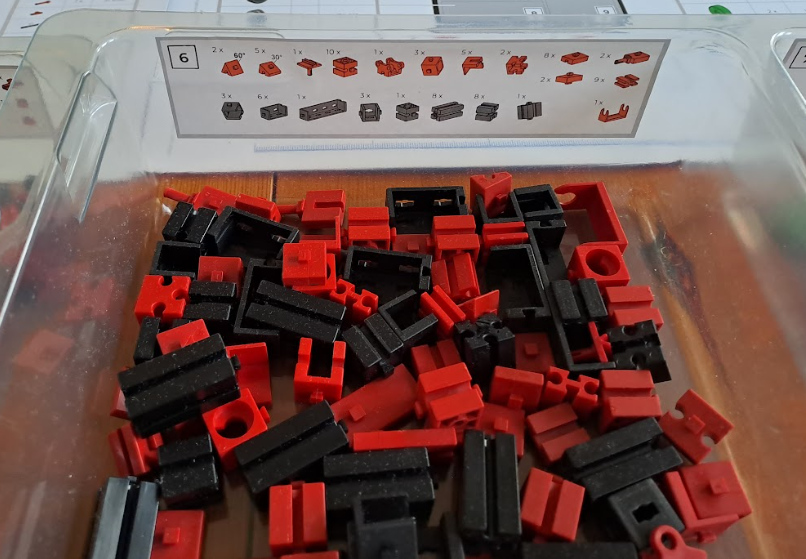
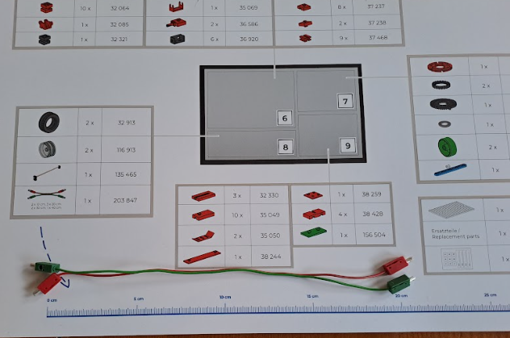

### Stem Coding Max - Baukasten

[Video](https://youtu.be/vTOGbhDAwJI)

Wir stellen die beiden Behälter nebeneinander. Wenn es der Platz zulässt, legen wir die Sortiervorlagen dazu. Die schwarze Box mit Deckel verstauen wir so, dass sie aus dem Weg ist, aber 
niemand drüber stolpert. Falls wir die große Platte für den Aufbau nicht brauchen, kommt die auch in die schwarze Box.

Die Aufkleber zeigen den Inhalt der Fächer. 

Eine der Sortiervorlagen hat unten ein Lineal, dort können wir die Kabellängen messen.

Kabel immer am Stecker entfernen, nie am Draht ziehen. 

