### LMZ-Modelle

Das Material auf dieser Seite stammt vom LMZ Baden-Württemberg [www.lmz-bw.de](www.lmz-bw.de).
Alle Programme speichern wir im Ordner *comthink/lmz_modelle*. Kursiv vor dem Doppelpunkt steht der vorgeschlagene Programmname.

#### 01 Blinklichter einer Windkraftanlage

Hohe Windkraftanlagen benötigen, um Flugzeuge zu warnen, ein rotes Blinklicht an ihrer Spitze. Das Licht blinkt in einem vorgegebenen Ablauf: 1 Sekunde an, 0,5 Sekunden aus, 1 Sekunde an und dann 1,5 Sekunden aus.

*windkraft*: Baut einen Turm für eine Windkraftanlage. Bringt eine LED oben am Turm an. Programmiert ein Blinklicht mit dem vorgegebenen Ablauf.

*windkraft_mit_rotor*: Baut einen Rotor auf den Turm des Windrads und lasst ihn mit einem Motor drehen.

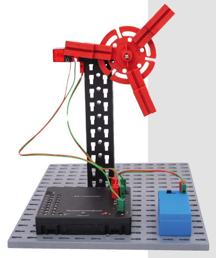

#### 02 SOS-Blinklicht

Morsen ist eine Methode zur Kommunikation, bei der Buchstaben durch kurze und lange Impulse (Punkte und Striche) dargestellt werden. Das Notrufzeichen „SOS“ wird häufig als Lichtsignal verwendet, wobei das „S“ aus drei kurzen und das „O“ aus drei langen Blink-Impulsen besteht.

*sos*: Schließt eine LED an den RX Controller an und schreibt ein Programm, das die LED in der Zeichenfolge „SOS“ als Lichtsignal leuchten lässt.

*morsen*: Stellt weitere Wörter mit der LED im Morsecode dar und lasst die Wörter von anderen Personen erraten.

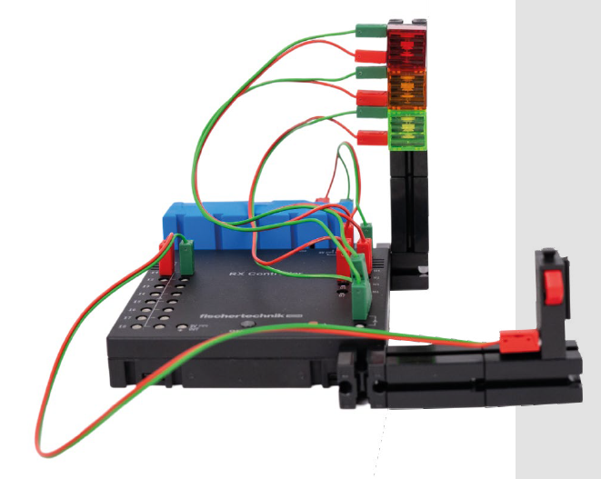 

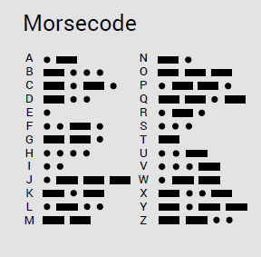 

#### 03 Ampelanlage

Ampeln steuern den Verkehr für Fahrzeuge und Fußgänger.

*ampel*: Schließt für die Ampelanlage drei LEDs in den Farben rot, gelb und grün sowie einen Taster an den RX
Controller an. Durch Betätigen des Tasters soll die Ampel von rot für eine Sekunde auf gelb und anschließend für fünf
Sekunden auf grün schalten. Danach soll sie wieder eine Sekunde gelb leuchten, bevor sie erneut rot anzeigt.
 
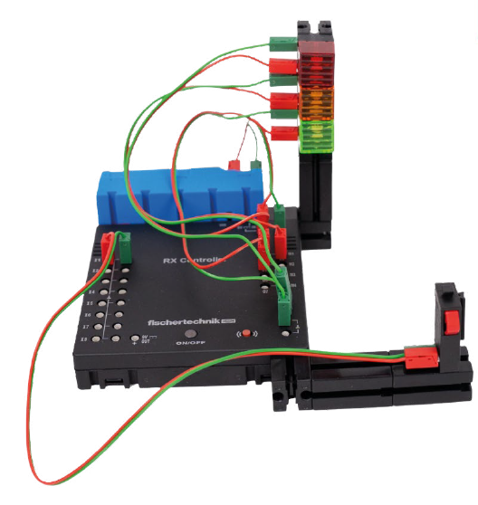 

#### 04 Schranke

Eine Schranke soll aufgehen, sobald sich ihr eine Person nähert. Danach soll die Schranke wieder geschlossen werden.

*schranke*: Baut eine Schranke aus einem Motor mit Getriebe. Schließt den Motor und den RGB-Gestensensor an den RX Controller an.
Programmiert die automatische Schranke. Hinweis: Zur zuverlässigeren Entfernungsmessung sollte der RGB-Gestensensor an der Tischkante platziert werden.

*schranke_mit_gesten:* Verwendet zur Steuerung der Schranke Gesten.

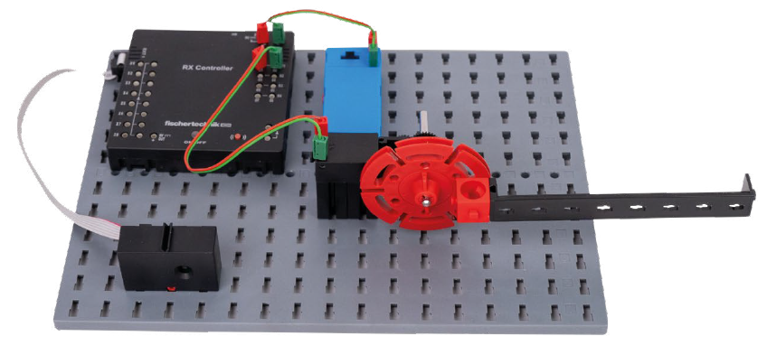 

#### 05 Quizshow

In Quizshows entscheidet oft die Schnelligkeit, wer eine Frage beantworten darf. Hierzu bekommt jeder Kandidat einen Buzzer und ein Licht leuchtet bei derjenigen Person, die diesen als erstes drückt.

*quizshow*: Schließt zwei Taster und zwei LEDs an den RX Controller an. Erstellt ein Spiel für zwei Teilnehmende, bei dem der erste Tasterdruck registriert wird. Sobald eine Person den Taster drückt, leuchtet die LED dieser Person auf und der Taster der anderen Person wird ignoriert.

*quizshow3*: Erweitert die Schaltung, indem ihr einen weiteren Taster und eine zusätzliche LED hinzufügt, sodass drei Teilnehmende gegeneinander spielen können.

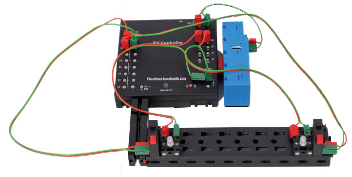 

#### 06 Hin- und Herbewegung

In vielen Unternehmen erledigen Maschinen Aufgaben automatisch, wie das Ein- und Ausräumen von Regalen oder den Transport von
Waren.

*hinundher:* Baut eine Konstruktion, bei der etwas von links nach rechts fahren kann. Ergänzt jeweils am Ende der Fahrbahn einen Taster, der von einem Fahrzeug aktiviert werden kann. Das Bild kann euch eine erste Idee liefern.
Programmiert das Fahrzeug so, dass es von allein gegen die beiden Taster fahren kann und anschließend die Richtung wechselt.

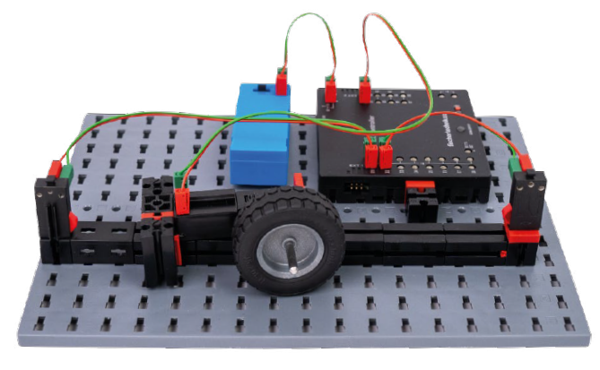 

#### 07 Ferngesteuerte Roxy

Ein ferngesteuerter Roboter kann in vielen Situationen nützlich sein. Ob in Katastrophengebieten zur Rettung von Menschen, im Restaurant, um das Essen an den Tisch zu fahren, oder in unzähligen anderen Situationen.

*fernsteuerung*: Baut Roxy nach Anleitung auf und ergänzt eine Fernsteuerung mit 4 Tastern (vor, zurück, rechts, links).
Programmiert die Taster so, dass ihr Roxy damit lenken könnt.

*parcour*: Baut einen Hindernisparcours auf, durch den ihr Roxy lenken könnt. Wer schafft es am schnellsten durch den Parcours? Könnt ihr im Programmcode noch Anpassungen vornehmen, damit ihr Roxy besser lenken könnt?

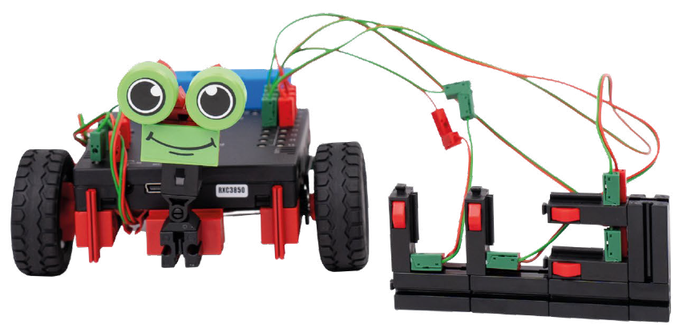 

#### 08 Autonome Roxy

Autonome Fahrzeuge erfassen ihre Umgebung mit Sensoren und reagieren selbstständig auf Hindernisse. Solche Systeme finden sich in Staubsaugerrobotern, Rasenmährobotern und selbstfahrenden Autos.

*autonomeRoxy:* Baut Roxy nach Anleitung zusammen und befestigt, wie auf dem Foto zu sehen, an der Vorderseite den RGB-Gestensensor. Schließt den RGB-Gestensensor an den RX Controller an. Programmiert den RGB-Gestensensor so, dass er als Entfernungsmesser Hindernisse erkennt. Bei einem auftretenden Hindernis soll Roxy dieses umfahren.

*autonomeRoxy_erweitert:* Verschiedene Erweiterungen sind möglich: Beispielsweise beginnt die Fahrt erst nach einem Tasterdruck.
Verschiedene LEDs zeigen, was Roxy gerade macht. Beispielsweise leuchtet eine rote LED, wenn ein Hindernis erkannt wird.
Verwendet den RGB-Gestensensor für weitere Fahrfunktionen.

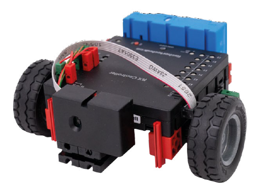 

#### 09 Zufallsgenerator

Das Binärsystem ist ein Zahlensystem, bei dem mit den Ziffern 0 und 1 Dezimalzahlen dargestellt werden können. Es wird in der Informatik verwendet, um Informationen zu speichern und zu übertragen.

*zufall:* Schließt drei LEDs und einen Taster an den RX Controller an.
Mit den drei angeschlossenen LEDs können Zahlen im Binärsystem angezeigt werden. Eine leuchtende LED steht für die Zahl 1 und eine ausgeschaltete LED für die Zahl 0. Programmiert einen Zufallsgenerator, der beim Drücken des Tasters mithilfe der LEDs eine Zufallszahl zwischen 0 und 7 anzeigt.

*ternaer*: Recherchiert, was das Ternärsystem ist. Die LEDs können auch nur schwach leuchten. Dadurch können die Ziffern 0 (LED ist aus), 1 (LED leuchtet leicht), 2 (LED leuchtet stark) dargestellt werden. Im Ternärsystem können mit den 3 LEDs dann Zahlen von 0 bis 17 dargestellt werden. Programmiert einen entsprechenden Zufallsgenerator.

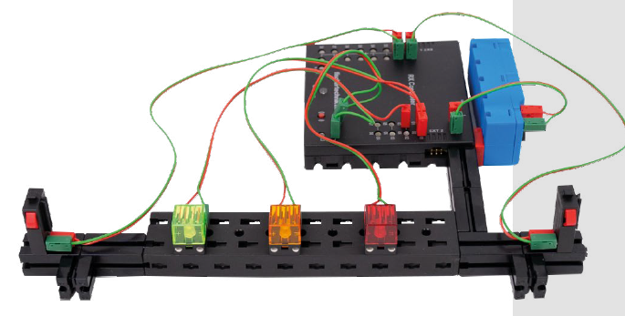 

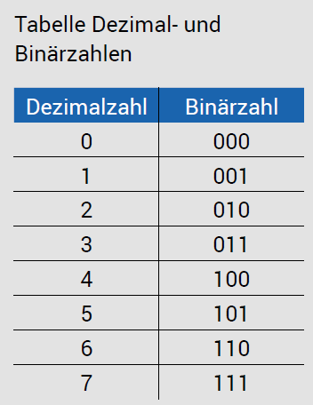 

#### 10 Reaktionsspiel

Die Reaktionsfähigkeit ist wichtig, um beispielsweise im Sport schnell reagieren zu können. Baut ein Spiel, dass eure Reaktionsfähigkeit testet.

*reaktion:* Schließt zwei Taster und drei LEDs an den RX Controller an.
Lasst die mittlere LED nach einer zufälligen Zeitspanne leuchten. Die Person, die als erste ihren Taster betätigt, bekommt einen Punkt und ihre LED geht kurz an. Anschließend beginnt der nächste Reaktionstest.

*reaktion5:* Sobald die erste Person fünf Mal gewonnen hat, soll die LED der Gewinnerin oder des Gewinners mehrmals blinken.

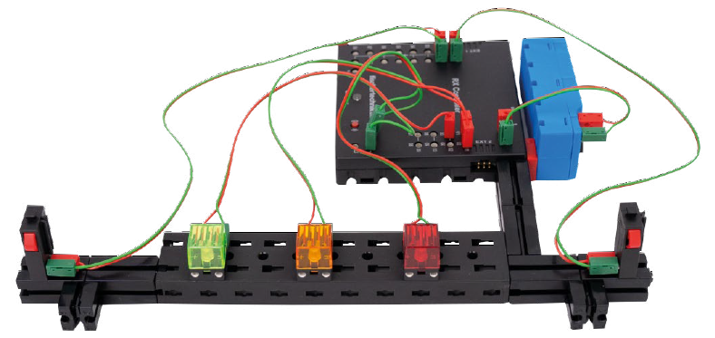 
 