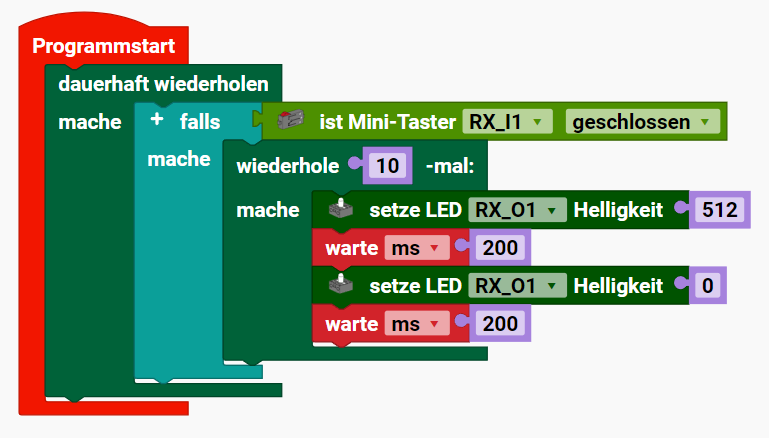
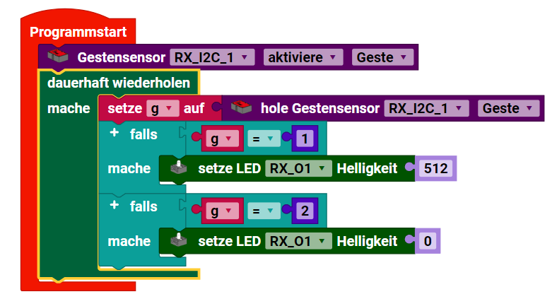

### RX-Controller mit Python Programmieren

[Video](https://youtu.be/Bl89vNOSaPs)

In dem RX-Controller ist ein MicroPython implementiert. MicroPython implementiert einen Teil der Python Standard Library. Die Version, die auf dem RX-Controller läuft, ist mir nicht bekannt.

[MicroPython Reference](https://docs.micropython.org/en/latest/index.html)


#### Python-Muster

```
import fischertechnik.factories as ff
from fischertechnik.logging import log as print 
import asyncio

async def check(t1,led):
    while True:
        # tuwas mit t1 und led
        await asyncio.sleep(0.05)

async def run(controller):
    # Faktories initialisieren
    ff.init_controller_factory()
    ff.init_motor_factory()              # Motor    
    ff.init_input_factory()              # Taster, Reed-Switch
    ff.init_output_factory()             # LED
    ff.init_i2c_factory()                # Gestensensor  

    m1 = ff.motor_factory.create_motor(controller, 1)             # Motor  
    t1 = ff.input_factory.create_mini_switch(controller, 1)       # Taster
    reed = ff.input_factory.create_mini_switch(controller, 2)     # Reed-Switch  
    led1 = ff.output_factory.create_led(controller, 2)            # LED  
    sensor = ff.i2c_factory.create_gesture_sensor(controller, 1)  # Gestensensor  

    # nicht-blockierende Task
    task1 = asyncio.create_task(check(t1,led1))
    task1.cancel()

    while True:
        # Taster
        t1.is_open()
        t1.is_closed()
        t1.get_state()
            
        # LEDs
        led1.set_brightness(512)
        led1.set_brightness(0)

        # Motor
        m1.set_speed(200, 1)     # 1 oder -1
        m1.start(), 
        m1.stop()

        # Gestensensor als Gestensensor
        sensor.enable_gesture()
        sensor.get_gesture()
        sensor.disable_gesture()

        # Gestensensor als Lichtsensor
        sensor.enable_light()
        sensor.get_rgb()              # Farberkennung  
        sensor.get_hex()
        sensor.get_hsv()
        sensor.get_ambient()          # Umgebungslicht
        sensor.disable_light()

        # Gestensensor als Näherungssensor
        sensor.enable_proximity()
        sensor.get_proximity()
        sensor.disable_proximity()   
        
        await asyncio.sleep(0.01)
```


#### Beispiel: Blinklicht



```
import fischertechnik.factories as ff
from fischertechnik.logging import log as print 
import asyncio

async def run(controller):
    ff.init_controller_factory()
    ff.init_input_factory()              # Taster  
    ff.init_output_factory()             # LED

    t1 = ff.input_factory.create_mini_switch(controller, 1)       # Taster I1
    led1 = ff.output_factory.create_led(controller, 1)            # LED O1

    while True:

        if t1.is_closed():
            for i in range(10):
                led1.set_brightness(512)
                await asyncio.sleep(0.2)
                led1.set_brightness(0)
                await asyncio.sleep(0.2)
        
        await asyncio.sleep(0.01)
```


#### Beispiel: Handbewegung



```
import fischertechnik.factories as ff
from fischertechnik.logging import log as print 
import asyncio

async def run(controller):
    ff.init_controller_factory()
    ff.init_output_factory()             # LED
    ff.init_i2c_factory()                # Gestensensor  

    led1 = ff.output_factory.create_led(controller, 1)            # LED O1
    sensor = ff.i2c_factory.create_gesture_sensor(controller, 1)  # Gestensensor EXT1
    sensor.enable_gesture()

    while True:
        g = sensor.get_gesture()
        if g == 1:
            led1.set_brightness(512)
        elif g == 2:
            led1.set_brightness(0)

        await asyncio.sleep(0.01)
```

#### Beispiel: Mehrere Blinklichter

Dieses Beispiel ist in Python deutlich einfacher als in Scratch oder Blockly. Hier können wir
Tasks losschicken, die den Rest nicht blockieren. Diese Möglichkeit haben wir in Scratch oder Blockly nicht.

```
import fischertechnik.factories as ff
from fischertechnik.logging import log as print
import asyncio

async def toggle_led(led, on_time, off_time):
    while True:
        led.set_brightness(512)  
        await asyncio.sleep(on_time)   
        led.set_brightness(0)   
        await asyncio.sleep(off_time)

async def run(controller):
    ff.init_controller_factory()
    ff.init_output_factory()

    led3 = ff.output_factory.create_led(controller, 3)
    led2 = ff.output_factory.create_led(controller, 2)
    led1 = ff.output_factory.create_led(controller, 1)

    asyncio.create_task(toggle_led(led3, 1, 2))
    asyncio.create_task(toggle_led(led2, 2, 1))
    asyncio.create_task(toggle_led(led1, 0.5, 0.2))

    while True:
        await asyncio.sleep(0.01)    
```