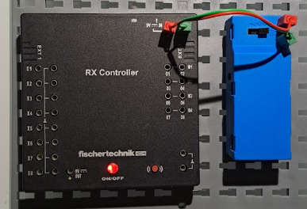

### Verkabelungen 

[Video](https://youtu.be/a_8ijYz5e4E)

Wir nehmen rot für plus und grün für minus.

#### Kontroller

Wenn wir wie abgebildet verkabeln, dann schalten wir die Stromversorgung
dadurch an, dass wir den schwarzen Schalter zu den Kabeln verschieben. Wir müssen dann einige Sekunden auf den on/off
Knopf des Controllers drücken, dann wird der das Kontrolllämpchen rot.

Wenn der Kontroller schon per USB-Kabel mit dem PC verbunden ist, dann wird das Kontrolllämpchen beim Einschalten nicht rot, sondern blinkt (langsam) blau. Ist die Verbindung mit der STEM Suite hergestellt, blinkt das Kontrolllämpchen schneller blau.

#### Lampen

Lampen haben einen markierten Plus-Eingang. Den verbinden wir mit einem der O1-O8 Ausgänge. 
Den anderen Lampenanschluss verbinden wir mit dem Minus-Ausgang des Kontrollers, d.h. mit einer der beiden Verbindungen mit dem umgedrehten T. Beim Anschluss von mehr als zwei Lampen könnnen wir dort Stecker ineinander stecken. 

Wenn wir beim Anschluss der Lampe Plus und Minus verwechseln, geht die Lampe nicht an. 

#### Motor

Den Motor schließen wir an einen der Ausgänge M1-M4 an. Hier ist Plus und Minus egal, der Motor dreht sich dann jeweils in die andere Richtung. Wir müssen nur darauf achten, dass wir am Motor nicht zweimal an derselben Seite anschließen. Wenn wir den Motorblock entlang des Nutstreifens teilen, müssen die beiden Kabel auf unterschiedlichen Seiten angeschlossen sein, sonst 
funktioniert der Motor nicht. 

#### Taster 

Taster werden mit einem der I1-I8 Eingänge verbunden.
Der Taster hat nummerierte Eingänge. Meistens werden wir die Kabel mit Eingang 1 und 3 verbinden, dann ist die Verbindung genau dann hergestellt, wenn wir den Taster drücken. Wo rot oder grün hinkommt, ist egal. 

Wenn wir die Kabel mit 2 und 3 verbinden, dann passiert nichts, die Verbindung kommt nicht zustande. Wenn die Kabel mit 1 und 2 verbunden werden, dann ist die Verbindung genau dann hergestellt, wenn der Taster nicht gedrückt ist.

